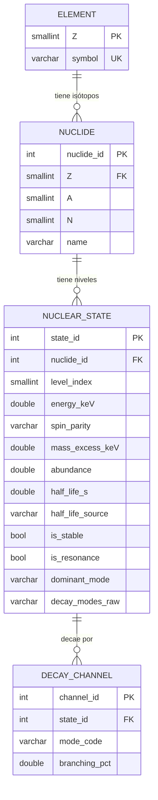

# Modelo relacional — NuDat (N/Z vs modo dominante)

Diseño de **4 tablas** alineado a la pregunta científica:

> ¿Cómo se relaciona la razón $N/Z$ con el modo de desintegración dominante ($\beta^-$ frente a $\beta^+$/EC) en los estados base?

Fuente de carga: `data/processed/` → `src/load_db.py`.

---

## 1. Por qué no una sola tabla

Un CSV plano mezcla elemento ($Z$), nuclido $(Z,A,N)$, estado (base/isómero, modo) y varios canales de decaimiento. Eso genera redundancia y dificulta integridad.

JOINs naturales de la pregunta:

- $N/Z$ y modo → `nuclide` + `nuclear_state`
- detalle de canales → `decay_channel`

---

## 2. Diagrama entidad–relación

| Relación | Tipo |
|----------|------|
| Elemento → Nuclido | 1 : N |
| Nuclido → Estado | 1 : N |
| Estado → Canal | 1 : N |

---

## 3. Atributos y claves

### `element`

| Atributo | Restricción |
|----------|-------------|
| `Z` | **PK** |
| `symbol` | **UNIQUE NOT NULL** |

### `nuclide`

| Atributo | Restricción |
|----------|-------------|
| `nuclide_id` | **PK** |
| `Z` | **FK → element** |
| `A`, `N`, `name` | |
| | **UNIQUE (Z, A)** |

$N/Z$ **no** se almacena: se calcula en SQL (`N / Z`).

### `nuclear_state`

| Atributo | Notas |
|----------|-------|
| `state_id` | **PK** |
| `nuclide_id` | **FK → nuclide** CASCADE |
| `level_index` | 0 = estado base (análisis principal) |
| `dominant_mode` | `B-`, `EC_BP`, `ALPHA`, `IT`, `OTHER`, `STABLE`, … |
| `is_stable`, `is_resonance` | flags |
| | **UNIQUE (nuclide_id, level_index)** |

### `decay_channel`

| Atributo | Notas |
|----------|-------|
| `channel_id` | **PK** |
| `state_id` | **FK → nuclear_state** CASCADE |
| `mode_code`, `branching_pct` | parseo de Wallet |

---

## 4. Consultas que el modelo debe soportar

1. Media de $N/Z$ por `dominant_mode` (GS).
2. Frontera $N/Z$ $\beta^-$ vs EC_BP por bins de $Z$.
3. Chart $N$–$Z$ coloreado por modo.
4. Modo mayoritario por bin de $Z$ (subconsulta).
5. Canales más frecuentes vía JOIN con `decay_channel`.

Ver [`sql/queries.sql`](../sql/queries.sql).

---

## 5. DBeaver

Tras `docker compose up` y `python -m src.load_db`, conectar a `localhost:3306` / `nudat` / `nudat` y generar el diagrama ER: deben verse estas 4 tablas con las FK anteriores.
